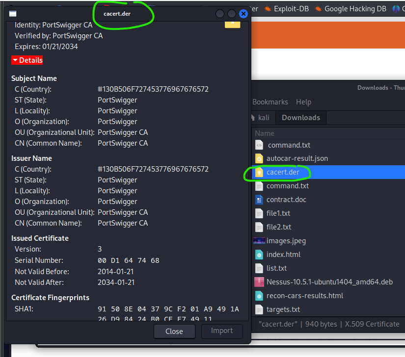
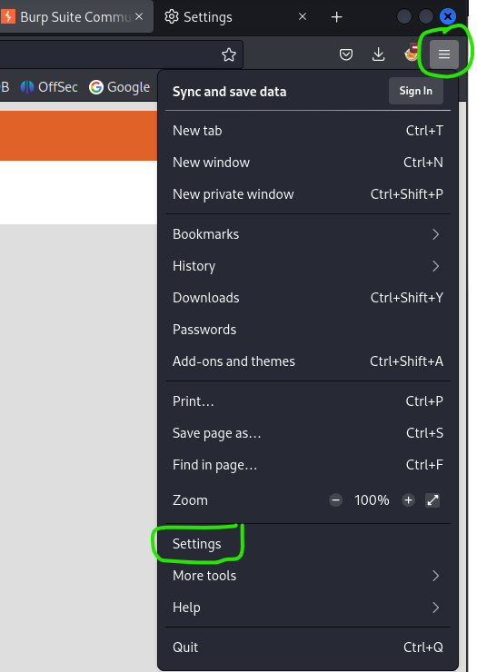
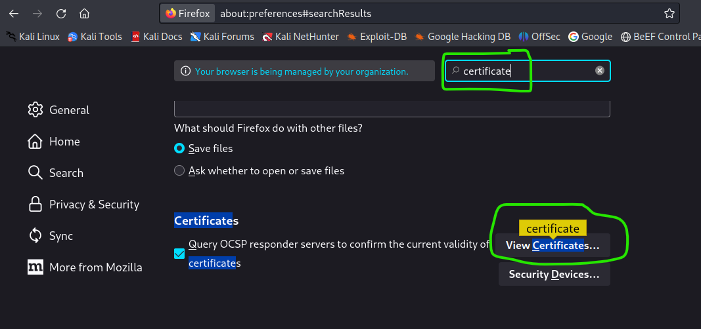
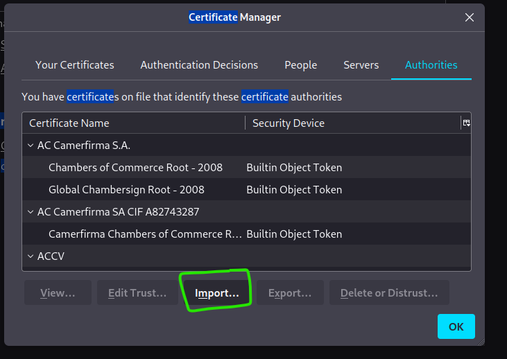
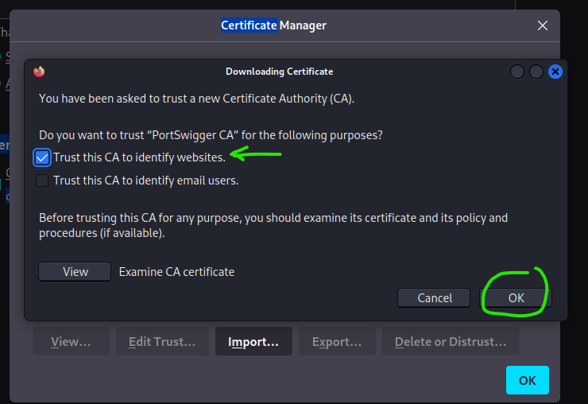
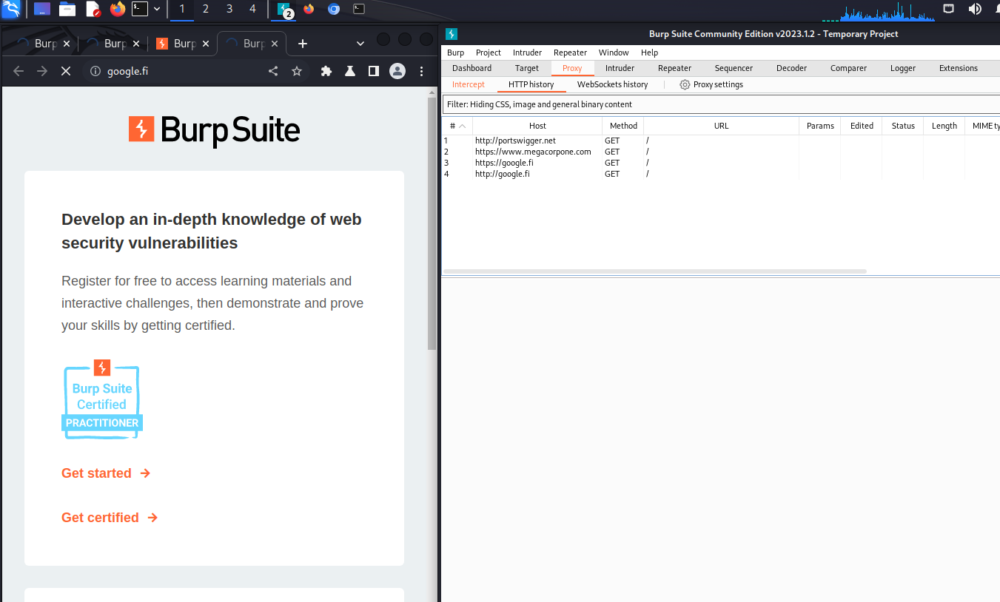
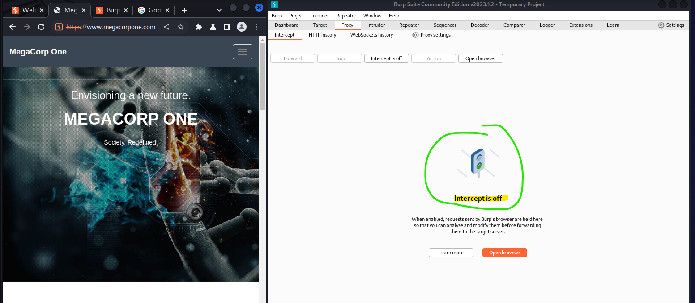
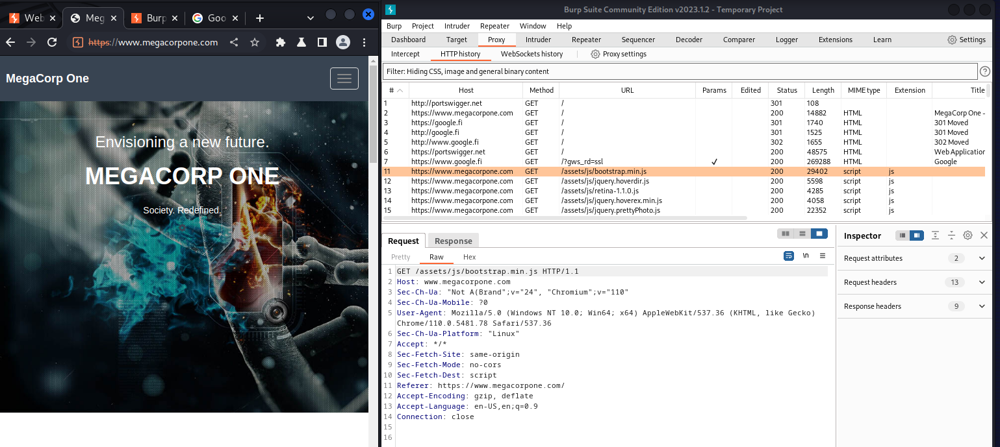
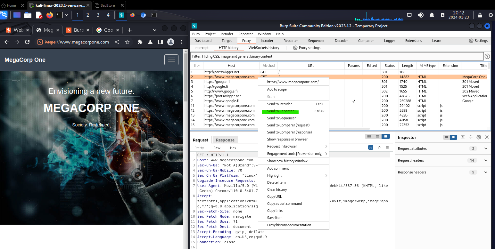
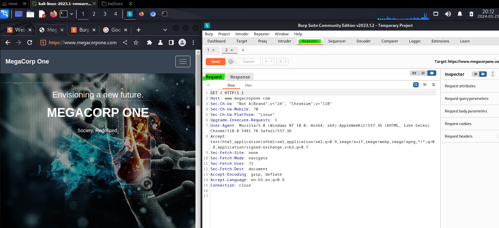

# Bup Suite SSL/TSL certificate

<!-- Offensive-Security-OSCP-by-Offensive-Security_2020.pdf practice page: 268 - 270 -->

same configuration idea, but different as book.
https://portswigger.net/burp/documentation/desktop/external-browser-config/certificate/ca-cert-firefox

Burp Suite can easily decyrpt the HTTPS protocol traffic by generating its own SSL/TSL certificate, which essentially man-in-the-middling attack ourselves in order to capture the traffic. These warning may be irritating, but we can prevent them by issuing a new certificate and importing it into FireFox.

Each Burp Suite CA (Certificate authority) certificate should be unique, which will ensure the by regenerating it. This setting can be found  "Proxy" > "Proxy settings" under the Tools - settings, click the "regenerate CA certificate" and will popup small window and accep it (YES).

After "yes" it may wonder why did not happening? Because there (may) need to restart this Burp Suite.

After restart open firefox empty tab and input the same host website as under the "Proxy listeners" 127.0.0.1:8080 & but book say open host "http://burp", but if open this site it may will nothing.. just try both anyway as IP-add and hostname.

Next step is add to hostname path "/cert" so it will give some document/files to tester/user, it will be to "download" folder path and make small check how it looks like.

Actually this file can download it just click on "CA certificate" on host; 127:0.0.1:8080, after download it need to open the "settings" / "options" / "prefeences". Kali Linux's the default browser as FireFox "might" different later.. and just open it and searh by name "certificate" , just scroll down and find "View certificates"

Open "View certificates", at "import" add that "cacert.der" file to there and configured, and installed.

After installed (OK), then go to any "https://" browser as Google or megacorpone, but at "Burp Suite" software inside can might see HTTPS history.. but there might be missing something if is the HTTPS history is empty. 

## https history

actually there no need install module/configured just use the Burp Suite inside the browsers which is one of the software one of the tool features.

