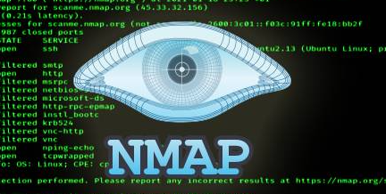

# NMAP

Network Mapper, mitä tunnetaan parhaiten hakkerien työkalua. Toiminnaltaan suorittaa tietoliikenteen porttienskannusta, että jopa skannatta sisäisen  tietojärjestelmän eri tietoliikenneporteissa toimivia ohjelmia ja käyttöjärjestelmiä sekä niiden haavoittuvuutta. 

Skannaa monien verkkoprotokollien kautta, mukaan lukien TCP, UDP, ICMP, SNMP ja monet muut.

Se luo yksityiskohtaisia ​​karttoja verkosta, jotka sisältävät olennaista tietoa siinä olevista laitteista.
Se käyttää räätälöitäviä porttiskannausmenetelmiä verkkolaitteissa käynnissä olevien eri palveluiden tunnistamiseen.

* [komentoja](#komentoja)

- [lisätieoriaa mikä on nmap](#lisätieoriaa-mikä-on-nmap)
    * [komentoja](#komentoja)
    * [hyödyllisiä harjoituksia](#hyödyllisiä-harjoituksia)



## komentoja

```
┌──(kali㉿kali)-[~]
└─$ nmap -h                
Nmap 7.93 ( https://nmap.org )
Usage: nmap [Scan Type(s)] [Options] {target specification}
TARGET SPECIFICATION:
  Can pass hostnames, IP addresses, networks, etc.
  Ex: scanme.nmap.org, microsoft.com/24, 192.168.0.1; 10.0.0-255.1-254
  -iL <inputfilename>: Input from list of hosts/networks
  -iR <num hosts>: Choose random targets
  --exclude <host1[,host2][,host3],...>: Exclude hosts/networks
  --excludefile <exclude_file>: Exclude list from file
HOST DISCOVERY:
  -sL: List Scan - simply list targets to scan
  -sn: Ping Scan - disable port scan
  -Pn: Treat all hosts as online -- skip host discovery
  -PS/PA/PU/PY[portlist]: TCP SYN/ACK, UDP or SCTP discovery to given ports
  -PE/PP/PM: ICMP echo, timestamp, and netmask request discovery probes
  -PO[protocol list]: IP Protocol Ping
  -n/-R: Never do DNS resolution/Always resolve [default: sometimes]
  --dns-servers <serv1[,serv2],...>: Specify custom DNS servers
  --system-dns: Use OS's DNS resolver
  --traceroute: Trace hop path to each host
SCAN TECHNIQUES:
  -sS/sT/sA/sW/sM: TCP SYN/Connect()/ACK/Window/Maimon scans
  -sU: UDP Scan
  -sN/sF/sX: TCP Null, FIN, and Xmas scans
  --scanflags <flags>: Customize TCP scan flags
  -sI <zombie host[:probeport]>: Idle scan
  -sY/sZ: SCTP INIT/COOKIE-ECHO scans
  -sO: IP protocol scan
  -b <FTP relay host>: FTP bounce scan
PORT SPECIFICATION AND SCAN ORDER:
  -p <port ranges>: Only scan specified ports
    Ex: -p22; -p1-65535; -p U:53,111,137,T:21-25,80,139,8080,S:9
  --exclude-ports <port ranges>: Exclude the specified ports from scanning
  -F: Fast mode - Scan fewer ports than the default scan
  -r: Scan ports sequentially - don't randomize
  --top-ports <number>: Scan <number> most common ports
  --port-ratio <ratio>: Scan ports more common than <ratio>
SERVICE/VERSION DETECTION:
  -sV: Probe open ports to determine service/version info
  --version-intensity <level>: Set from 0 (light) to 9 (try all probes)
  --version-light: Limit to most likely probes (intensity 2)
  --version-all: Try every single probe (intensity 9)
  --version-trace: Show detailed version scan activity (for debugging)
SCRIPT SCAN:
  -sC: equivalent to --script=default
  --script=<Lua scripts>: <Lua scripts> is a comma separated list of
           directories, script-files or script-categories
  --script-args=<n1=v1,[n2=v2,...]>: provide arguments to scripts
  --script-args-file=filename: provide NSE script args in a file
  --script-trace: Show all data sent and received
  --script-updatedb: Update the script database.
  --script-help=<Lua scripts>: Show help about scripts.
           <Lua scripts> is a comma-separated list of script-files or
           script-categories.
OS DETECTION:
  -O: Enable OS detection
  --osscan-limit: Limit OS detection to promising targets
  --osscan-guess: Guess OS more aggressively
TIMING AND PERFORMANCE:
  Options which take <time> are in seconds, or append 'ms' (milliseconds),
  's' (seconds), 'm' (minutes), or 'h' (hours) to the value (e.g. 30m).
  -T<0-5>: Set timing template (higher is faster)
  --min-hostgroup/max-hostgroup <size>: Parallel host scan group sizes
  --min-parallelism/max-parallelism <numprobes>: Probe parallelization
  --min-rtt-timeout/max-rtt-timeout/initial-rtt-timeout <time>: Specifies
      probe round trip time.
  --max-retries <tries>: Caps number of port scan probe retransmissions.
  --host-timeout <time>: Give up on target after this long
  --scan-delay/--max-scan-delay <time>: Adjust delay between probes
  --min-rate <number>: Send packets no slower than <number> per second
  --max-rate <number>: Send packets no faster than <number> per second
FIREWALL/IDS EVASION AND SPOOFING:
  -f; --mtu <val>: fragment packets (optionally w/given MTU)
  -D <decoy1,decoy2[,ME],...>: Cloak a scan with decoys
  -S <IP_Address>: Spoof source address
  -e <iface>: Use specified interface
  -g/--source-port <portnum>: Use given port number
  --proxies <url1,[url2],...>: Relay connections through HTTP/SOCKS4 proxies
  --data <hex string>: Append a custom payload to sent packets
  --data-string <string>: Append a custom ASCII string to sent packets
  --data-length <num>: Append random data to sent packets
  --ip-options <options>: Send packets with specified ip options
  --ttl <val>: Set IP time-to-live field
  --spoof-mac <mac address/prefix/vendor name>: Spoof your MAC address
  --badsum: Send packets with a bogus TCP/UDP/SCTP checksum
OUTPUT:
  -oN/-oX/-oS/-oG <file>: Output scan in normal, XML, s|<rIpt kIddi3,
     and Grepable format, respectively, to the given filename.
  -oA <basename>: Output in the three major formats at once
  -v: Increase verbosity level (use -vv or more for greater effect)
  -d: Increase debugging level (use -dd or more for greater effect)
  --reason: Display the reason a port is in a particular state
  --open: Only show open (or possibly open) ports
  --packet-trace: Show all packets sent and received
  --iflist: Print host interfaces and routes (for debugging)
  --append-output: Append to rather than clobber specified output files
  --resume <filename>: Resume an aborted scan
  --noninteractive: Disable runtime interactions via keyboard
  --stylesheet <path/URL>: XSL stylesheet to transform XML output to HTML
  --webxml: Reference stylesheet from Nmap.Org for more portable XML
  --no-stylesheet: Prevent associating of XSL stylesheet w/XML output
MISC:
  -6: Enable IPv6 scanning
  -A: Enable OS detection, version detection, script scanning, and traceroute
  --datadir <dirname>: Specify custom Nmap data file location
  --send-eth/--send-ip: Send using raw ethernet frames or IP packets
  --privileged: Assume that the user is fully privileged
  --unprivileged: Assume the user lacks raw socket privileges
  -V: Print version number
  -h: Print this help summary page.
EXAMPLES:
  nmap -v -A scanme.nmap.org
  nmap -v -sn 192.168.0.0/16 10.0.0.0/8
  nmap -v -iR 10000 -Pn -p 80
SEE THE MAN PAGE (https://nmap.org/book/man.html) FOR MORE OPTIONS AND EXAMPLES

```

# lisätieoriaa mikä on nmap

https://www.topsevenreviews.com/fi/nmap-review/ <br>
https://www.trucoteca.com/fi/mik%C3%A4-on-nmap/ <br>

## komentoja 

https://www.linuxadictos.com/fi/nmap.html#Escaner_Xmas
https://kulonpaa.com/?p=259
https://tonivapalo.com/posts/tunkeutumistestaus/ptvt4/
https://owasp.org/www-pdf-archive/Analysing_Networks_with_NMAP.pdf

## hyödyllisiä harjoituksia

https://armerj.github.io/SQLi-BadStore/
https://cyb3r-cod3r.blogspot.com/2017/04/badstore-vulnerabilities.html
https://www.youtube.com/watch?v=jmYSAz8U08Q


